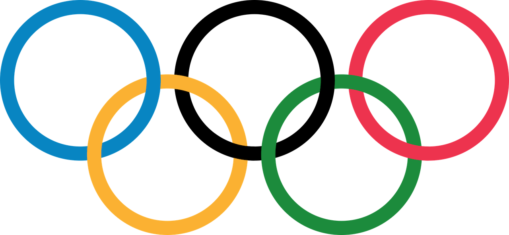

<h2>1995 Olympics Site Remake w/CSS </h2>

CSS included in an HTML assignment where the idea was to create 'a webpage that looks like a 1995 webpage'. The assignment was originally [HTML-only](https://github.com/zain-ak/1995-Olympics-Site-Remake) but I decided to add some CSS to it for the sake of learning, and also to try and give it a much more modern look. I also made use of some of the animation features that CSS offers which makes the site much more interactive.

I've included a [link](https://web.archive.org/web/19961223053702/http://www.olympic.org/) to the original Olympics website from 1995 for a comparison of what I was up against. 

